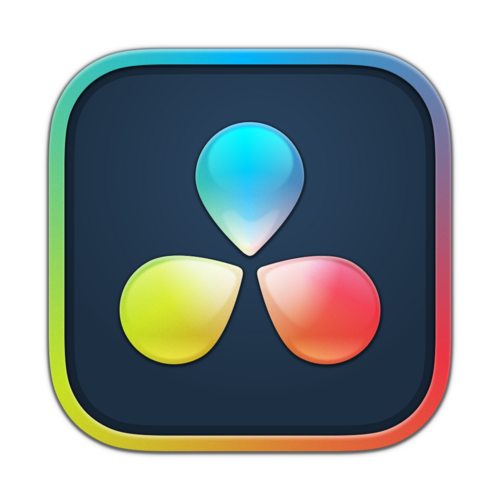

## Hello there, I'm Chiang.

- Cadet at [42 Malaysia](https://www.instagram.com/42malaysia/).
- Ex CGI / VFX lighting artist at [Tau Films](https://taufilms.com/).
- Ex lecturer at [The One Academy](https://www.toa.edu.my/).

---

#### Tech Stacks & Tools:

| | |
| --- | ---|
| Programming Languages |          |
| CGI / VFX |        |
| Multimedia |       |

<!--
- 🔭 I’m currently working on ...
- 🌱 I’m currently learning ...
- 👯 I’m looking to collaborate on ...
- 🤔 I’m looking for help with ...
- 📫 How to reach me: ...
- 💬 Ask me about ...
- 😄 Pronouns: ...
- ⚡ Fun fact: ...
-->
