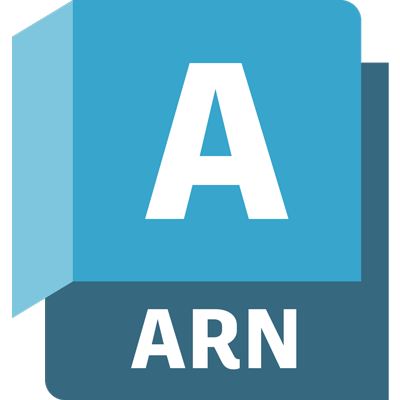

<div align="center">

## Software Engineer With An Unusual Background

### Hi, I'm **Chiang**!

I spent years crafting light and rendering photorealistic worlds as a CGI/VFX artist and teaching the craft as a lecturer — now I apply that same systematic, detail-obsessed thinking to programming in C, C++ as well as Python. \
\
I build programs the same way I used to build 3D scenes: deliberately, layer by layer, systematically.

###

<a href="https://www.linkedin.com/in/chiangkaizhi" target="_blank"></a>
&nbsp;
<a href = "mailto: kaizhi3006@gmail.com"></a>
</br>

### VFX Tools


&nbsp;.&nbsp;

&nbsp;.&nbsp;

&nbsp;.&nbsp;

&nbsp;.&nbsp;

&nbsp;.&nbsp;

&nbsp;.&nbsp;


### Tech Stack


&nbsp;.&nbsp;

&nbsp;.&nbsp;

&nbsp;.&nbsp;

&nbsp;.&nbsp;

&nbsp;.&nbsp;


###

<a href="https://github.com/KrunchiZ">
  
  <!--  -->
</a>

### Project Showcase

<a href="https://github.com/KrunchiZ/minishell">
  
</a>
<a href="https://github.com/KrunchiZ/fdf">
  
</a>
<br/><br/>
<a href="https://github.com/KrunchiZ/kyouth-job-listing-profiler">
  
</a>
<a href="https://github.com/KrunchiZ/kyouth-skill-gap-ai-analyzer">
  
</a>

###


###

</div>

---

### 42 Kuala Lumpur
[**42KL**](https://www.instagram.com/42malaysia/) is a tuition-free, future-proof computer science school with a peer-to-peer learning environment that does not involve teachers and lectures. It is an innovative education model that was designed to develop the skills needed to develop technical and people skills that match the expectations of the labor market using a project-based learning approach. \
\
The unforgiving curriculum is exactly the kind of environment I thrive in. Projects span system programming, OOP, algorithms, Unix internals, networking, containers, data engineering and beyond.

---

### How My Past Shapes My Code

Working in VFX hsa taught me to break complex systems into layers, optimize for performance (render times are unforgiving), and communicate technical ideas to non-technical people — skills that translate directly into writing clean, efficient codes and pipelines. \
\
Furthermore, lecturing at **The One Academy** has sharpened my ability to explain *why* something works, not just that it does.

| **Experience**          | **Company**                                               |
| ---                     | ---                                                       |
| Workshop Facilitator    | [42 Kuala Lumpur](https://www.instagram.com/42malaysia/)  |
| CGI/VFX Lighting Artist | [Tau Films](https://taufilms.com/)                        |
| Lecturer                | [The One Academy](https://www.toa.edu.my/)                |

---

<div align="center">

*```From rendering CGI to writing systems — always building something that makes sense under the hood.```*


</div>
